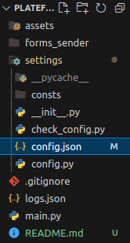

# Exemples d'utilisation

## Modification du fichier config

Ceci est le fichier a modifier avant l'execution du script

## Lancement du scipt
```Python3 main.py```
[Paramètres du script](assets/parameters.png)
Vous pouvez modifier ces valeures
auto_reset_config: lorsque set a True, le fichier de config modifiable se remettra par défaut a chaque lancement du script
test_mode: changez le a False, pour enlever le test_mode. Le test_mode execute le script SANS envoyé de formulaire. Il faudrait bien être sur d'avoir compris l'utilisation avant de lancer le script sans le test_mode

## Exemples
[Exemple d'un envoi multiple](assets/good_example_multiple.png)
[Exemple d'un envoi d'un form](assets/good_single.png)
- A noter, auto = true ou false, est l'ajout d'un nom généré automatiquement
- Le script en fonctionnne uniquement qu'avec un envoie singulier ou multiple **pas les deux**

# Installation requise

- Python
- Faker ```pip install Faker```
